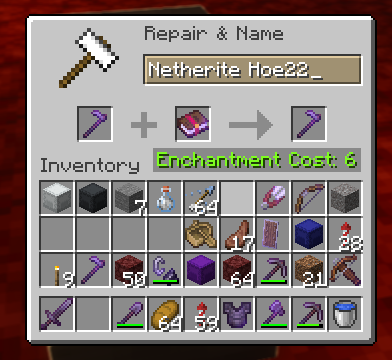

# AnvilReset
A SpigotMC Plugin for resetting item's repair costs

Usage :
- `/anvilresetitem` Resets Item Repair Coost

Before :

After `/anvilresetitem` 

Config:
- `levels_to_reset`: Player's Level Deduction (Has to be > 0, Default is 30)
- `reset_to`: Reset Item to what repair cost (Has to be >= 0, Default is 1)
- `minimum_item_levels`: Minimum Item repair cost to perform reset command (Has to be >= 0, Default is 30)
